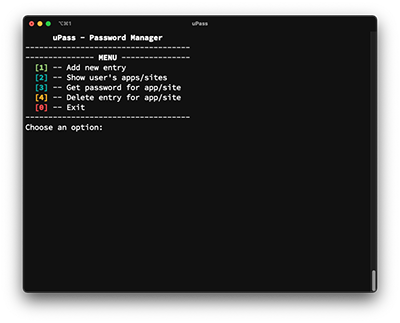
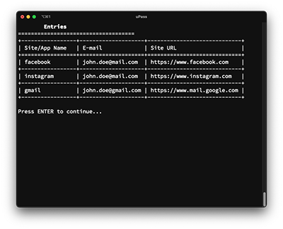

# uPass - Password Manager

> App that safely stores encrypted passwords in the database

[](https://forthebadge.com) [](https://forthebadge.com)

This project was created for learning purposes. The goal of this application is to store various accounts and their passwords in the database in a secure way via terminal/console.

The app works like majority similar password managers - user creates account (with master password) and then adds passwords to various apps or websites. Passwords are stored in the database in encrypted form (AES Encryption with the master password's hash as a key). User can view all the accounts he has saved, get password to the specified account (the password will be automatically copied to the clipboard) or delete the specified account entry.

 

## Technologies

This project was built with Python v3.11.1 and uses following technologies:

- [psycopg](https://www.psycopg.org) (v2.9.5) - PostgreSQL Database
- [Pyinstaller](https://pyinstaller.org/en/stable/) (v5.8.0) - creates a folder with executable that users can immediately run without any extra installation

## How To Use

### Download

You can download the package with finished executable version of this application from [here](https://1drv.ms/u/s!AlGBPTpcrcFXi38JsrrOObiO-iLY?e=IgIGCd)
(select version for your operating system and save this folder to your compupter).

### Lauching the application

Enter the downloaded folder and run (double click) the file:

- macOS - `uPass (Unix Executable File)`
- Windows - `uPass.exe`

> _Note_: when you run the app for the first time you don't have an account yet, so you have to create one first

Run (double click)

- macOS - `uPass - Register (Unix Executable File)`
- Windows - `uPass - Register.exe`

and create account (follow instructions in app)

## Development setup

Follow the steps below to get started with this project's development environment.

> _Note_: this instruction assumes you have python installed on your computer

1. Clone this repository and navigate into it.

```sh
$ git clone https://github.com/mattkepa/upass-password-manager.git
$ cd upass-password-manager
```

2. Create python virtual environment.

```sh
$ python -m venv .venv
```

3. Activate virtual environment.

- MacOS / Linux

```sh
$ source .venv/bin/activate
```

- Windows

```sh
$ .\.venv\Scripts\activate
```

4. Install project's dependecies.

```sh
$ pip install -r requirements.txt
```

5. Run app.

```sh
$ python upass.py
```

or (for creating new account):

```sh
$ python create_account.py
```

> _Note_: for development purposes you must have your own database (see instructions below)

### Development database configuration

1. Create local PostgreSQL database (i.e. with postgres and pgAdmin4) or online instance (i.e. ElephantSQL)
2. Create two tables `users` and `entries` in this database

```sql
CREATE TABLE users(
    id SERIAL PRIMARY KEY,
    username VARCHAR(20) NOT NULL,
    password_hash TEXT NOT NULL,
    salt TEXT NOT NULL
);
CREATE TABLE entries(
    id SERIAL PRIMARY KEY,
    site_name VARCHAR(30) NOT NULL,
    email VARCHAR(40) NOT NULL,
    password BYTEA NOT NULL,
    site_url TEXT,
    user_id INTEGER REFERENCES users(id)
);
```

3. Attach databese to project:

- Create file `db.ini` in project's root folder

```
[postgresql]
host=<hostaddres|localhost>
database=<dbname>
user=<dbusername>
password=<dbpassword>
port=<dbport|5432>
```

## License

All code is released under the [MIT](./LICENSE) License.
